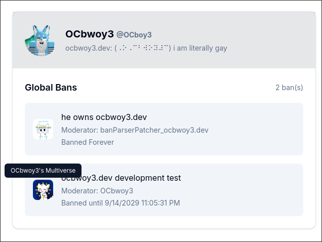

# 
112

The Global Ban Handler for Script Builders. (And OCbwoy3-Chan AI)
You can ban players here. Games who use your instance of this will ban sync your bans with theirs. If they're banned in your list, all games using it will not let the user join the server. Self explanatory, really.

**NOTE: People can access ALL of your GBans by accessing the `/banland.json` endpoint! It's all public!**

**How this would look like on [ocbwoy3.dev](https://ocbwoy3.dev/lookup?u=OCboy3)**:

If you are developing/using this on NixOS, if Prisma doesn't work, Install [direnv](https://direnv.net/docs/hook.html) and then re-open the shell and run `direnv allow` (or just use `steam-run`).

## Running This

**By hosting your version of this, you promise not to skid it, as well as follow the license terms.**

Required: Everything but Gemini API Key (it's optional, everything else is required)

## Additional notices

Russian OCbwoy3-Chan prompt by dev0xz03 on Discord.
