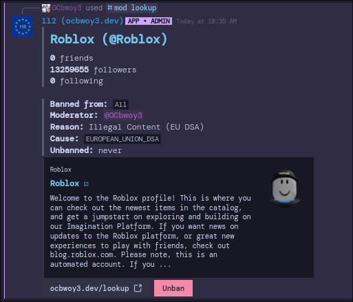
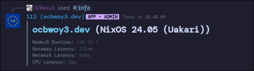

# 112
OCbwoy3's Super Cool Global Ban Handler for Script Builders.

It's named 112 for a reason.
You can ban players here. Games who use your instance of this will ban them.

You can see ALL preset ban reasons in `AllBanReasons.ts`.

**NOTE: People can access ALL of your GBans by accessing the `/banland.json` endpoint!**

If Prisma doesn't work, Install [direnv](https://direnv.net/docs/hook.html) and then re-open bash.

